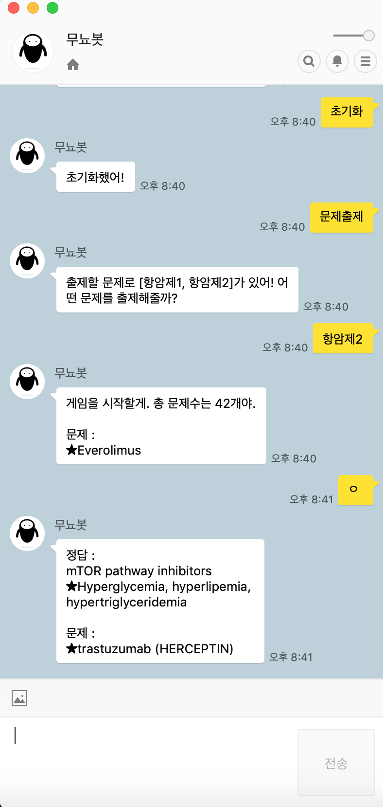

Kakaotalk chatbot for preparing examine
=======================================

It makes a question until you answer all questions.
 
If you know the answer, type "ㅇ" else anything
 
Start test by typing "문제 출제", then it will give you the list of exam files
 
Put your exam data as an excel type into data folder
 
 
**Following is the format you need to keep**

column A : Question
 
column B : Answer

 
After that, go to the main folder where git folder is placed and type

> python manage.py runserver 0.0.0.0:port_number
 

__port_number is needed to be changed__

